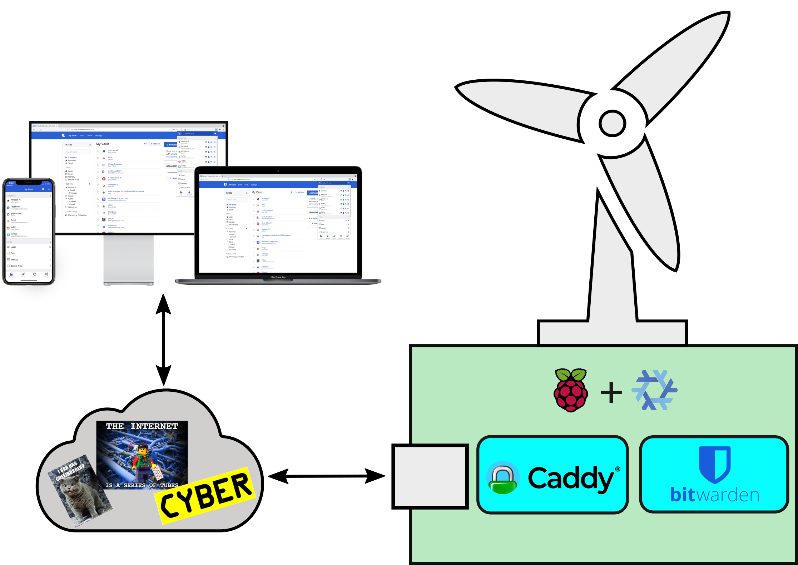

# Edgevault

> Host your Vaultwarden Server in a wind turbine for fun and profit!

If you're the kind of person who, 

- has an extra Raspberry Pi laying around
- and you're paranoid enough to self-host a [Vaultwarden](https://github.com/dani-garcia/vaultwarden) server
- but you haven't yet made friends with [NixOS](https://nixos.org/)

and you think the following setup is awesome



then all you need to do is make a few modifications to the [configuration.nix](./configuration.nix) file, and you're ready to go!

```nix
{ config, lib, pkgs, ... }:

let
  inherit (builtins) elemAt; #                   Similar to `import {nth} from lodash` in JS land
  defaultLocale = "de_DE.UTF-8"; #               "Enjoy your life in full trains"
  timeZone = "Europe/Berlin"; #                  "Bist wohl in de S-Bahn jebor'n!"
  hostName = "key-keeper"; #                     "Security by obscurity is also a thing" 
  domainName = "z.cip.li";  #                    That cool domain name you otherwise never use...
  examesh = { #                                  Examesh.de is our Edge Data Center Provider
    ipv4.address = "10.237.1.26"; #              Our collocated Pi must use this static IP
    ipv4.prefixLength = 24; #                    With this prefix (netmask: 255.255.255.0) 
    defaultGateway = "10.237.1.1"; #             And this default gateway 
    allowedTCPPorts = [ 22 6001 ]; #             TCP ports 22 and 6001 are externally accessible
  };
  ssh.pubKey =
    "ssh-ed25519 AAAAC3NzaC1lZDI1NTE5AAAAICUVCcNS/DQXPNmW0ohhRXGYgoZ7u6SBWcHDXzoi5AWf nixos@forseti";

in {
  modules.sshd = { 
    enable = true;
    port = (elemAt examesh.allowedTCPPorts 0);
  };
  modules.acme = { #                             Fetches a TLS certificate for your host
    enable = true;
    email = "john.doe@cip.li"; #                   Let's Encrypt likes to have your email address
    dnsProvider = "cloudflare"; #                Use DNS to provide proof of domain ownership
    credentialsFile = ./credentials.env; #       Your DNS Provider's credentials, in .gitignore!
  };
  modules.caddy = { #                            Use Caddy as a reverse proxy for vaultwarden
    enable = true;
    port = (elemAt examesh.allowedTCPPorts 1);
  };
  modules.vaultwarden = {
    enable = true;
    backupFolder = "/etc/nixos/vaultwarden"; #   Backup your vaultwarden DB and other assets here
  };
```

## Sign up with an Edge Data Center Provider

The default [configuration.nix](./configuration.nix) file in this repository works out-of-the-box for the Pi Collocation offerings from [ExaMesh GmbH](https://examesh.de/en/instances/pi/colocation/), but it should be simple to expand it for other Providers as well.

Examesh recommends the following hardware requirements for running your Pi in their collocation: 

- SD card for long-term use, e.g. Transcend High Endurance (Gold) or SanDisk Max Endurance
- CE certified AC power supply with 3.0A / 5.1V
- Raspberry Pi without any case: No cooling enclosures, no plastic enclosures, etc.

## Provision your Pi

This section is based on the information documented in the [NixOS wiki](https://nixos.wiki/wiki/NixOS_on_ARM#Installation).

### Raspberry Pi 3

You can find the latest `nixos-*.img.zstd` file which you can copy to your Pi's SD card in the [latest hydra build here](https://hydra.nixos.org/job/nixos/release-21.11/nixos.sd_image.aarch64-linux).

```sh
# Assuming your SD card has been recognized as device /dev/mmcblk0
# and the nixos image has been downloaded+decompressed to the /tmp/ folder
sudo dd if=/tmp/nixos-sd-image-*-21.11-aarch64-linux.img of=/dev/mmcblk0 bs=1024 status=progress
```

After you have copied the latest NixOS relase to the Pi's SD card, connect up your pi to a monitor, keyboard and a router and boot up into the new, barebones NixOS configuration.

### Copy this repository to /etc/nixos

``` sh
# First enter into a nix shell which contains the `git` command
nix-shell -p git
# Now clone this repository to /etc/nixos
git clone https://github.com/sdaros/edgevault /etc/nixos
```

### Modify lines 5 to 16 in [configuration.nix](./configuration.nix) to match your deployment

- You can find valid locale values by executing `locale -a` in your terminal and valid timezones in the directory pointed to by the `$TZDIR` environment variable (usually in `/usr/share/zoneinfo`)
``` sh
defaultLocale = "de_DE.UTF-8";
timeZone = "Europe/Berlin";
```
- The combination of the hostname and domain name you choose, your Fully Qualified Domain Name (FQDN), will be used by [go-acme/lego](https://go-acme.github.io/lego/) to mint you a new TLS certificate backed by Let's Encrypt
``` sh
hostName = "key-keeper";
domainName = "z.cip.li";
```
- Examesh will provide you with a static, private IP address that you will need to hardcode in your Pi. They will also port forward SSH traffic (and two additional TCP ports) from their public IP Address to your private IP address. 
``` sh
examesh = {
  ipv4.address = "10.237.1.26";
  ipv4.prefixLength = 24;
  defaultGateway = "10.237.1.1";
  allowedTCPPorts = [ 22 6001 ];#  Port 22 and 6001 are mapped to external TCP Port 9007 and 9008 respectively
};
```
- The following SSH public key (password login is disabled) must be used to login to the Pi as the normal (non-privileged) user `nixos`
``` sh
  ssh.pubKey =
    "ssh-ed25519 AAAAC3NzaC1lZDI1NTE5AAAAICUVCcNS/DQXPNmW0ohhRXGYgoZ7u6SBWcHDXzoi5AWf nixos@forseti";
```

### Apply your changes

Executing `sudo nixos-rebuild switch --upgrade` will apply the changes you've made to the `configuration.nix` file.

*Note: since your Pi is now configured with the Static IP Address and Default Gateway you defined, you will not be able to connect out to the internet*

Your Raspberry Pi is now configured and ready to be shipped to your Edge Data Center Provider!

## On first boot in your new Edge Data Center

After your Pi has been installed and configured you can connect to it using ssh.

``` sh
# Assuming your SSH public key is located in ~/.ssh/id_ed25519 and examesh
# has mapped your internal SSH port to the external TCP port 9007
ssh -i ~/.ssh/id_ed25519 -p 9007 oprema.exame.sh
[nixos@key-keeper:~]$ # Here you are, at the edge of the interwebs...
```

Since our goal is to run a Vaultwarden server on our Pi, we have to go ahead and modify the default [configuration.nix](./configuration.nix) file to activate this module, and supporting modules. This repository abstracts the implementation of the Vaultwarden server (and the supporting ACME and Caddy components) in `.nix` files located in the [./modules](./modules/) folder.

Before activating these modules, it is important to have the following prerequisites in place.

### Prerequisites 

1. You need to have your registered domain name managed by a DNS Provider which provides a publicly available API. This repository defaults to using [Cloudflare](https://www.cloudflare.com/dns).

2. You must add a DNS entry (an `A` record or `CNAME` record should do) which points to the public IP address, or Fully Qualified Domain Name, provided to you by your Edge Data Center provider. For Examesh, I added a simple `CNAME` record which points to `oprema.exame.sh`.

3. You need to generate an API token which can be used to programatically create/modify/delete DNS records within the domain. This token should, by default, be stored in the `/etc/nixos/credentials.env` file. The contents of this file will look like this if you are using [Cloudflare API tokens](https://developers.cloudflare.com/api/tokens/create):

``` sh
CLOUDFLARE_DNS_API_TOKEN=Cvm15dredactedddddddddddddd-AnKIredacted
```

### Activate all modules by modifying lines 23 to 36 in [configuration.nix](./configuration.nix) to match your deployment

- The [`acme.nix`](./modules/acme.nix) module is powered by [go-acme/lego](https://go-acme.github.io/lego/) and since it issues TLS certificates from Let's Encrypt it needs to know your email address in order to notify you of pending TLS certificate expiration. This module will, by default, use the Cloudflare API for the ACME challenges. You can however choose another provider from the [list of supported DNS Providers](https://go-acme.github.io/lego/dns/).
``` sh
  modules.acme = {
    enable = true;
    email = "john.doe@cip.li";
    dnsProvider = "cloudflare";
    credentialsFile = ./credentials.env;
  };
```
- The [`caddy.nix`](./modules/caddy.nix) module is used to as a reverse proxy for Vaultwarden. It should be configured to listen on the TCP Port forwarded from the external internet by your Provider. 
``` sh
modules.caddy = {
  enable = true;
  port = (elemAt examesh.allowedTCPPorts 1);
};
```
- The [`vaultwarden.nix`](./modules/vaultwarden.nix) module will initiate a Vaultwarden Server using a default, sane configuration. It will also backup your Vaultwarden Server sqlite database and associated assets (attachments, icons, etc.) to the `/etc/nixos/vaultwarden` folder on a daily interval.
``` sh
  modules.vaultwarden = {
    enable = true;
    backupFolder = "/etc/nixos/vaultwarden";
  };
```

### Apply your changes

Execute `sudo nixos-rebuild switch` one last time to apply the changes you've made to the `configuration.nix` file.

## Now profit!

You should now have a shiny new Vaultwarden Server, running behind a Caddy reverse proxy, secured with a TLS certificate provided by Let's Encrypt. Connect to it with your browser by navigating to  https://key-keeper.z.cip.li:9008 and testing it out.

## Importing data from an existing Vaultwarden installation

Vaultwarden will, in its standard configuration, store all persistent data (which includes the sqlite database file, attachments, icons and other assets) into the folder defined by the `DATA_FOLDER` environment variable. If we assume that `DATA_FOLDER` points to `var/lib/bitwarden_rs` then we can use the following commands to backup all of our Vaultwarden data:

``` sh
# login as the root user
sudo su -
# create the backup folder
mkdir -p /root/vaultwarden_backup
# make a backup of the Vaultwarden sqlite database
sqlite3 /var/lib/bitwarden_rs/db.sqlite3 ".backup /root/vaultwarden_backup/db.sqlite3"
# copy over all other important files
cp /var/lib/bitwarden_rs/rsa_key.{der,pem,pub.der} "$BACKUP_FOLDER"
cp -r /var/lib/bitwarden_rs/attachments "$BACKUP_FOLDER"
cp -r /var/lib/bitwarden_rs/icon_cache "$BACKUP_FOLDER"
```

# LICENSE

MIT License

Copyright (c) 2021 Stefano Da Ros
